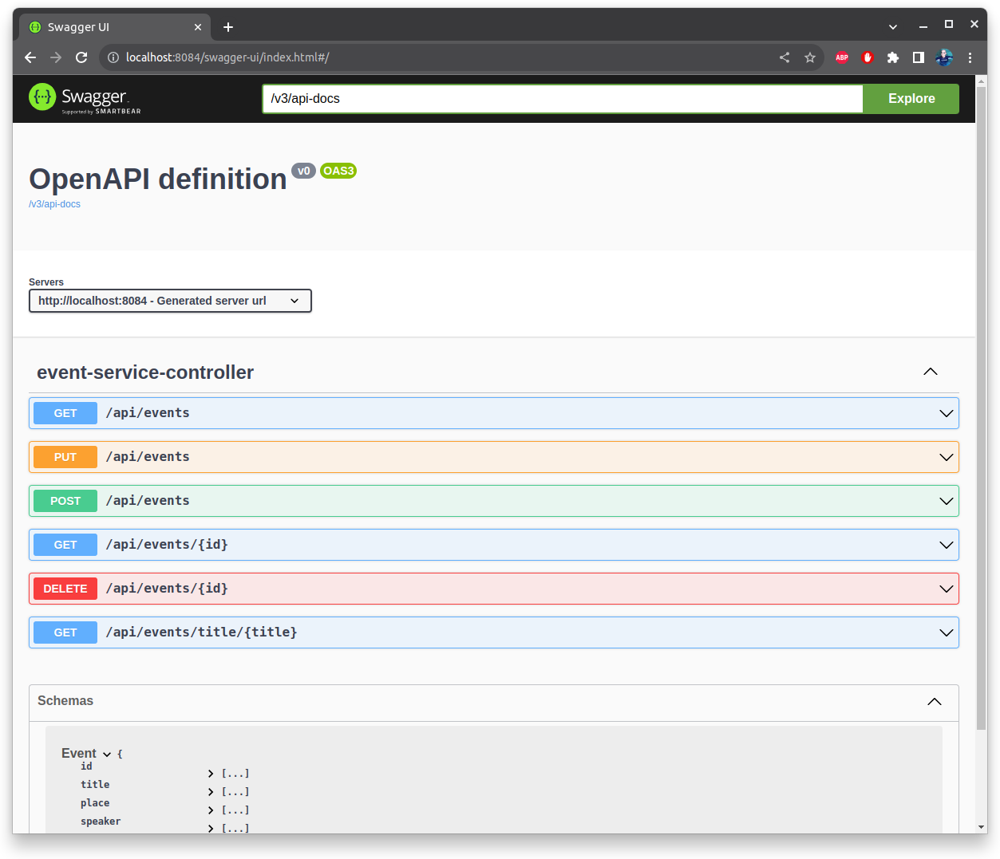

# Event Service Project

This project is a Java-based Spring Boot application that provides an Event Service with RESTful API endpoints for managing events. It consists of several modules, including API, DTO, implementation, and a REST controller.

## Modules

1. **eventEntity-service-api**: Contains the EventService interface with methods for creating, updating, deleting, and retrieving events.

2. **eventEntity-service-dto**: Contains the Event class with fields such as id, title, place, speaker, eventType, and dateTime.

3. **eventEntity-service-impl**: Implements the EventService interface with in-memory storage for managing events.

4. **eventEntity-service-rest**: Provides a RESTful API interface using Spring MVC for the EventService. It includes a Swagger UI for documentation.

## Prerequisites

Before running this project, ensure you have the following prerequisites:

- Java Development Kit (JDK) installed (Java 8 or higher)
- Apache Maven installed
- Git (optional, for cloning the repository)

## Getting Started

Follow these steps to set up and run the project:

1. Clone the repository (if you haven't already):

   ```shell
   git clone https://github.com/josevicenteayala/RestAPITasks.git
   cd events
    ```
## Build the project using Maven
In the root of the project run the following command

    mvn clean install
## Run the spring boot application

    cd eventEntity-service-rest
    mvn spring-boot:run
The application will start and be accessible at http://localhost:8084/api/events.

# Project Structure
The project is organized as follows:

events: Root project.
eventEntity-service-api: Defines the EventService interface.
eventEntity-service-dto: Contains the Event data transfer object.
eventEntity-service-impl: Implements the EventService interface with in-memory storage.
eventEntity-service-rest: Main module containing the Spring Boot application class. Ir provides RESTful API endpoints and Swagger documentation.

# Accessing Swagger UI
To access the Swagger documentation for the Event Service using Swagger UI. Open a web browser and go to the following URL:

   http://localhost:8084/swagger-ui/index.html#/

This URL will take you to the Swagger UI interface, where you can explore and test the available REST API endpoints for the Event Service.



# Contributors

Jose Vicente Ayala Luna

# License

This project is licensed under the Apache License 2.0

This README provides an overview of the project, prerequisites, setup instructions, and customization suggestions.

